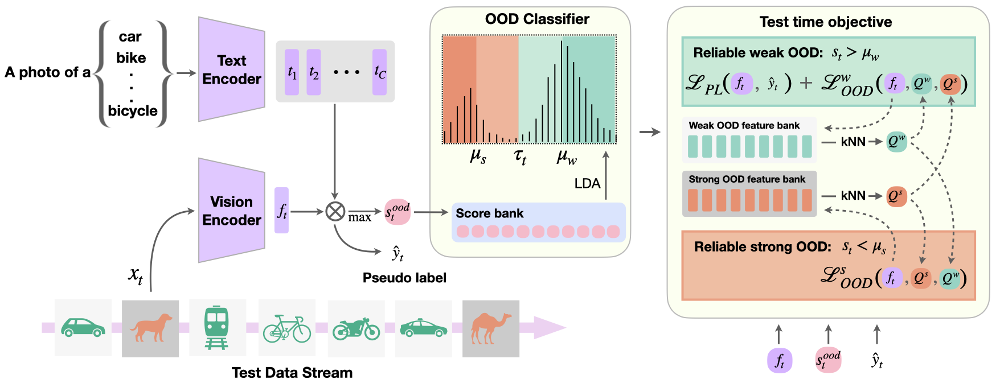

# ROSITA

Official code implementation for the paper "Effectiveness of Vision-Language Models for Open-World Single Image Test Time Adaptation"

> 
 <b> ROSITA framework</b>:
> The test samples with weak and strong OOD data arrive one at a time. The image features are matched with the text based classifier, the confidence scores of which are used to distinguish between weak and strong OOD samples through a simple LDA based OOD classifier. Based on this classification and if a sample is identified to be reliable, the feature banks are updated and test-time objective is optimized to update the LayerNorm parameters of the Vision Encoder.

> **
 Abstract:** *We propose a novel framework to address the real-world challenging task of Single Image Test-Time Adaptation in an open and dynamic environment. We leverage large-scale Vision Language Models like CLIP to enable real-time adaptation on a per-image basis without access to source data or ground truth labels. Since the deployed model can also encounter unseen classes in an open world, we first employ a simple and effective Out of Distribution (OOD) detection module to distinguish between weak and strong OOD samples. 
We propose a novel contrastive learning based objective to enhance discriminability between weak and strong OOD samples by utilizing  small, dynamically updated feature banks. 
By pushing weak and strong OOD samples apart in the latent space using reliable test samples, our method continuously improves OOD detection performance. 
Finally, we also employ a classification objective for adapting the model using the reliable weak OOD samples. 
The final objective combines these components, enabling continuous online adaptation of Vision Language Models on a single image basis. 
Extensive experimentation on diverse domain adaptation benchmarks validates the effectiveness of the proposed framework.* 

----------
### Installation

Please follow the instructions at [INSTALL.md](docs/INSTALL.md) to setup the environment.

### Dataset preparation: 

Please follow the instructions at [DATASETS.md](docs/DATASETS.md) to prepare the datasets.

### Experiments: 

Please follow the instructions at [RUN.md](docs/RUN.md) to run the experiments.

-------------
The baselines have been established with the help these repositories:

1. [TPT](https://github.com/azshue/TPT)
2. [PromptAlign](https://github.com/jameelhassan/PromptAlign)
3. [OWTTT](https://github.com/Yushu-Li/OWTTT)

